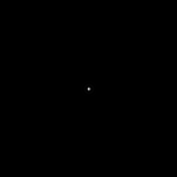
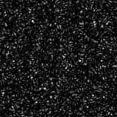
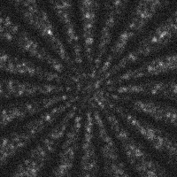

# Code to simulate Random Illumination Microscopy (RIM) images

This repository contains useful functions to simulate simple Point Spread Function (PSFs), random speckles and microscopy images with measurement noise. All function can be used with Octave and should be compatible with Matlab.
Only 1D and 2D simulations are supported.

See file named `example.m` containing a commented example on how to generate PSF, speckle and RIM images:

     
     
     

# List of the main functions

- simOTF
- simSpeckles

# Contributions 

Any contribution is welcome, to do so create your own branch and when you are ready create a pull request on the main branch.

